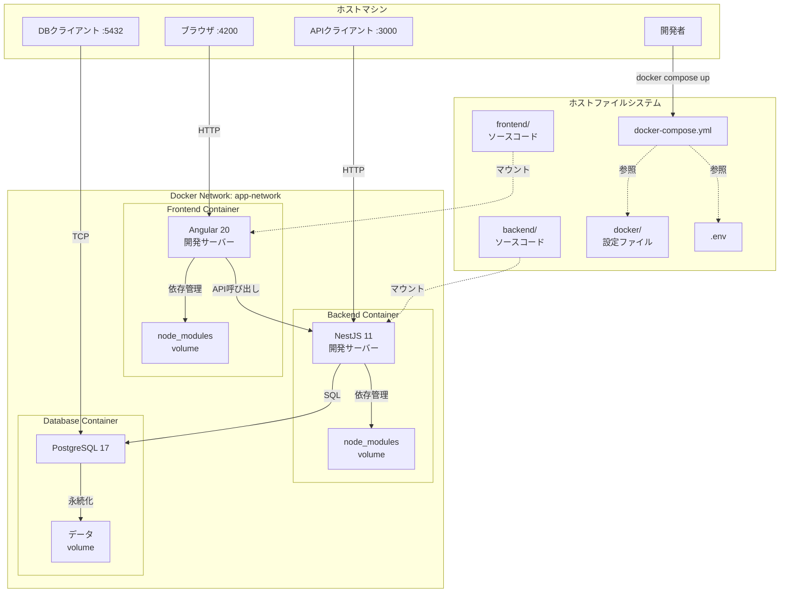

# 設計書

## 概要

本ドキュメントは、Angular20、NestJS11、PostgreSQL17を使用したコンテナベースのアプリケーション基盤の設計を定義します。この基盤は、Docker Composeを使用して3つのコンテナ（Frontend、Backend、Database）を管理し、開発環境の迅速な立ち上げと一貫性のある実行環境を提供します。

### 設計目標

1. **シンプルな環境構築**: 単一のコマンドで全ての開発環境を起動
2. **開発体験の最適化**: Hot Reload、デバッグ機能、ソースマップの提供
3. **データの永続化**: ボリュームを使用したデータとnode_modulesの管理
4. **保守性の向上**: Docker関連ファイルとソースコードの明確な分離
5. **スケーラビリティ**: 将来的な機能追加や環境拡張への対応

## アーキテクチャ

### システム構成図



### レイヤー構成

1. **インフラストラクチャ層**: Docker Compose、ネットワーク、ボリューム
2. **コンテナ層**: Frontend、Backend、Database コンテナ
3. **アプリケーション層**: Angular、NestJS、PostgreSQL
4. **データ層**: ボリュームによる永続化

## コンポーネントとインターフェース

### 1. Docker Compose設定

**責務**: 全てのコンテナとリソースの定義と管理

**主要設定**:
- サービス定義（frontend、backend、database）
- ネットワーク定義（app-network）
- ボリューム定義（postgres-data、frontend-node-modules、backend-node-modules）
- 環境変数の読み込み（.envファイル）

**インターフェース**:
- コマンド: `docker compose up -d`, `docker compose down`, `docker compose ps`, `docker compose logs`
- 設定ファイル: `docker-compose.yml`
- 環境変数ファイル: `.env`

### 2. Frontend Container

**責務**: Angular20アプリケーションの実行環境を提供

**技術スタック**:
- ベースイメージ: `node:22-alpine`
- フレームワーク: Angular 20
- パッケージマネージャー: npm
- アーキテクチャ: Zoneless + Signals
- TypeScript: 5.8以上
- 追加パッケージ: `tzdata`（タイムゾーン設定用）

**Angular 20の特徴**:
- **Zonelessモード**: Zone.jsを使用せず、明示的な変更検知を採用
- **Signalsベース**: 状態管理にSignalsを使用し、細かい粒度の変更検知を実現
- **スタンドアロンコンポーネント**: NgModuleを使用しない新しいアーキテクチャ
- **新しい制御フロー構文**: `@if`, `@for`, `@switch`を使用
- **パフォーマンス最適化**: Zone.jsの削除により約50KBのバンドルサイズ削減

**ポート**:
- 4200: Angular開発サーバー（ホストにバインド）

**ボリューム**:
- `./frontend:/app`: ソースコードのマウント

**環境変数**:
- `NODE_ENV`: 実行環境（development/production）
- `API_URL`: バックエンドAPIのURL
- `TZ`: タイムゾーン（デフォルト: Asia/Tokyo）

**起動コマンド**: `npm start` (Angular開発サーバーの起動)

**インターフェース**:
- HTTP: ポート4200でWebアプリケーションを提供
- API呼び出し: バックエンドコンテナへのHTTPリクエスト

### 3. Backend Container

**責務**: NestJS11アプリケーションの実行環境を提供

**技術スタック**:
- ベースイメージ: `node:22-alpine`
- フレームワーク: NestJS 11
- パッケージマネージャー: npm

**ポート**:
- 3000: NestJS開発サーバー（ホストにバインド）
- 9229: デバッグポート（ホストにバインド）

**ボリューム**:
- `./backend:/app`: ソースコードのマウント

**環境変数**:
- `NODE_ENV`: 実行環境（development/production）
- `DATABASE_HOST`: データベースホスト名
- `DATABASE_PORT`: データベースポート
- `DATABASE_USER`: データベースユーザー名
- `DATABASE_PASSWORD`: データベースパスワード
- `DATABASE_NAME`: データベース名
- `TZ`: タイムゾーン（デフォルト: Asia/Tokyo）

**起動コマンド**: `npm run start:dev` (NestJS開発サーバーの起動)

**依存関係**: Database Containerの起動完了を待機

**インターフェース**:
- HTTP API: ポート3000でRESTful APIを提供
- データベース接続: PostgreSQLへのTCP接続

### 4. Database Container

**責務**: PostgreSQL17データベースの実行環境を提供

**技術スタック**:
- ベースイメージ: `postgres:17`（Debianベース、カスタムDockerfileでビルド）
- データベース: PostgreSQL 17
- ロケール: 日本語ロケール（ja_JP.UTF-8）対応

**ポート**:
- 5432: PostgreSQLサーバー（ホストにバインド）

**ボリューム**:
- `postgres-data:/var/lib/postgresql/data`: データベースデータの永続化
- `./docker/postgres/init:/docker-entrypoint-initdb.d`: 初期化スクリプト

**環境変数**:
- `POSTGRES_USER`: データベースユーザー名
- `POSTGRES_PASSWORD`: データベースパスワード
- `POSTGRES_DB`: データベース名
- `POSTGRES_INITDB_ARGS`: 初期化オプション（`--encoding=UTF8 --lc-collate=C --lc-ctype=C`）
- `TZ`: タイムゾーン（デフォルト: Asia/Tokyo）
- `PGTZ`: PostgreSQL用タイムゾーン（デフォルト: Asia/Tokyo）

**ロケール設定**:
- `LC_COLLATE`: `C`（バイナリソート、パフォーマンス重視）
- `LC_CTYPE`: `C`（バイナリ文字分類、パフォーマンス重視）
- `LC_MESSAGES`: `ja_JP.UTF-8`（日本語エラーメッセージ）
- `LC_MONETARY`: `ja_JP.UTF-8`（日本語通貨表示）
- `LC_NUMERIC`: `ja_JP.UTF-8`（日本語数値表示）
- `LC_TIME`: `ja_JP.UTF-8`（日本語日時表示）

**タイムゾーン設定**:
- データベースタイムゾーン: `Asia/Tokyo`（初期化スクリプトで設定）
- コンテナタイムゾーン: `Asia/Tokyo`（環境変数で設定）

**ヘルスチェック**:
- コマンド: `pg_isready -U ${POSTGRES_USER}`
- 間隔: 30秒
- タイムアウト: 10秒
- リトライ: 3回

**インターフェース**:
- TCP: ポート5432でPostgreSQLプロトコルを提供

### 5. ネットワーク

**責務**: コンテナ間の通信を提供

**ネットワーク名**: `app-network`

**ドライバー**: bridge

**機能**:
- コンテナ名による名前解決（DNS）
- コンテナ間の内部通信
- 外部からのアクセス制限（公開ポートのみ）

### 6. ボリューム

**責務**: データの永続化

**ボリューム一覧**:

1. **postgres-data**
   - 用途: PostgreSQLデータの永続化
   - マウント先: `/var/lib/postgresql/data`

## データモデル

### 環境変数スキーマ

```.env
# Node環境
NODE_ENV=development

# タイムゾーン設定
TZ=Asia/Tokyo

# データベース接続情報
DATABASE_HOST=database
DATABASE_PORT=5432
DATABASE_USER=postgres
DATABASE_PASSWORD=postgres
DATABASE_NAME=app_db

# API設定
API_URL=http://backend:3000
```

### ディレクトリ構造

```
project-root/
├── docker/                      # Docker関連ファイル
│   ├── frontend/
│   │   ├── Dockerfile          # Frontend用Dockerfile
│   │   └── .dockerignore       # Frontend用除外設定
│   ├── backend/
│   │   ├── Dockerfile          # Backend用Dockerfile
│   │   └── .dockerignore       # Backend用除外設定
│   └── postgres/
│       ├── Dockerfile          # PostgreSQL用カスタムDockerfile
│       └── init/               # データベース初期化スクリプト
│           ├── 00-set-timezone.sh  # タイムゾーン設定
│           └── 01-init.sql     # 初期スキーマ
├── frontend/                    # Angularソースコード
│   ├── src/
│   ├── angular.json
│   ├── package.json
│   └── tsconfig.json
├── backend/                     # NestJSソースコード
│   ├── src/
│   ├── nest-cli.json
│   ├── package.json
│   └── tsconfig.json
├── docker-compose.yml          # Docker Compose設定
├── .env                        # 環境変数（gitignore対象）
├── .env.example                # 環境変数のサンプル
└── .gitignore                  # Git除外設定
```

## 正式性プロパティ

*プロパティとは、システムの全ての有効な実行において真であるべき特性や動作のことです。これは、人間が読める仕様と機械で検証可能な正しさの保証との橋渡しとなります。*

このセクションでは、インフラストラクチャの設定が要件を満たしていることを検証するためのプロパティを定義します。これらのプロパティは、設定ファイルの検証やコンテナの動作確認を通じて検証されます。

### プロパティ1: Docker Compose設定ファイルの存在と配置

*任意の*プロジェクトルートにおいて、docker-compose.ymlファイルが存在し、バージョン3.8以上の構文を使用している必要があります。

**検証方法**: ファイルの存在確認とYAMLパース

**検証要件**: 要件1.4, 1.5

### プロパティ2: 3つのサービス定義

*任意の*docker-compose.yml設定において、frontend、backend、databaseの3つのサービスが定義されている必要があります。

**検証方法**: docker-compose.ymlのservicesセクションの確認

**検証要件**: 要件1.1

### プロパティ3: ポートマッピングの正確性

*任意の*サービス設定において、以下のポートマッピングが定義されている必要があります：
- Frontend: 4200:4200
- Backend: 3000:3000, 9229:9229
- Database: 5432:5432

**検証方法**: docker-compose.ymlのportsセクションの確認

**検証要件**: 要件2.1, 3.1, 4.1, 9.2

### プロパティ4: ボリューム定義の完全性

*任意の*docker-compose.yml設定において、postgres-dataの名前付きボリュームが定義されている必要があります。

**検証方法**: docker-compose.ymlのvolumesセクションの確認

**検証要件**: 要件7.1

### プロパティ5: ソースコードマウントの正確性

*任意の*サービス設定において、以下のボリュームマウントが定義されている必要があります：
- Frontend: ./frontend:/app
- Backend: ./backend:/app

**検証方法**: docker-compose.ymlのvolumesセクションの確認

**検証要件**: 要件2.4, 3.4, 11.9

### プロパティ6: ネットワーク設定の一貫性

*任意の*サービス設定において、全てのサービスが同一のネットワーク（app-network）に接続されている必要があります。

**検証方法**: docker-compose.ymlのnetworksセクションの確認

**検証要件**: 要件5.1

### プロパティ7: 環境変数の提供

*任意の*Backend設定において、DATABASE_HOST、DATABASE_PORT、DATABASE_USER、DATABASE_PASSWORD、DATABASE_NAMEの環境変数が定義されている必要があります。

**検証方法**: docker-compose.ymlのenvironmentセクションの確認

**検証要件**: 要件3.7, 6.2

### プロパティ8: データベースヘルスチェックの設定

*任意の*Database設定において、pg_isreadyコマンドを使用したヘルスチェックが30秒間隔、3回リトライで設定されている必要があります。

**検証方法**: docker-compose.ymlのhealthcheckセクションの確認

**検証要件**: 要件8.1, 8.2, 8.3

### プロパティ9: サービス依存関係の定義

*任意の*Backend設定において、databaseサービスへの依存関係（depends_on）が定義されている必要があります。

**検証方法**: docker-compose.ymlのdepends_onセクションの確認

**検証要件**: 要件8.4

### プロパティ10: Dockerfileの存在と配置

*任意の*プロジェクト構造において、docker/frontend/Dockerfileとdocker/backend/Dockerfileが存在する必要があります。

**検証方法**: ファイルの存在確認

**検証要件**: 要件11.3, 11.4

### プロパティ11: Dockerfileのベースイメージ

*任意の*Dockerfileにおいて、FrontendとBackendはnode:22をベースイメージとして使用する必要があります。

**検証方法**: DockerfileのFROM命令の確認

**検証要件**: 要件10.1, 10.2

### プロパティ12: PostgreSQLイメージバージョン

*任意の*Database設定において、postgres:17イメージを使用する必要があります。

**検証方法**: docker-compose.ymlのimageセクションの確認

**検証要件**: 要件10.3

### プロパティ13: ディレクトリ構造の完全性

*任意の*プロジェクト構造において、以下のディレクトリが存在する必要があります：
- docker/frontend
- docker/backend
- docker/postgres
- frontend
- backend

**検証方法**: ディレクトリの存在確認

**検証要件**: 要件11.1, 11.2, 11.6, 11.7

### プロパティ14: .gitignore設定

*任意の*.gitignoreファイルにおいて、.envファイルが除外対象として定義されている必要があります。

**検証方法**: .gitignoreファイルの内容確認

**検証要件**: 要件6.5

### プロパティ15: 再起動ポリシー

*任意の*サービス設定において、restart: unless-stoppedが定義されている必要があります。

**検証方法**: docker-compose.ymlのrestartセクションの確認

**検証要件**: 要件9.5

## エラーハンドリング

### 1. コンテナ起動失敗

**シナリオ**: コンテナが起動に失敗する

**原因**:
- ポートの競合
- イメージのビルド失敗
- 環境変数の不足

**対処**:
- `docker compose logs <service>` でログを確認
- ポート使用状況を確認（`lsof -i :<port>`）
- .envファイルの設定を確認
- イメージを再ビルド（`docker compose build --no-cache`）

### 2. データベース接続失敗

**シナリオ**: BackendがDatabaseに接続できない

**原因**:
- データベースの起動が完了していない
- 環境変数の設定ミス
- ネットワーク設定の問題

**対処**:
- ヘルスチェックの状態を確認（`docker compose ps`）
- 環境変数を確認（`docker compose exec backend env`）
- ネットワーク接続を確認（`docker compose exec backend ping database`）

### 3. Hot Reload動作不良

**シナリオ**: ソースコード変更が反映されない

**原因**:
- ボリュームマウントの設定ミス
- ファイル監視の制限
- node_modulesの競合

**対処**:
- ボリュームマウントを確認（`docker compose config`）
- コンテナを再起動（`docker compose restart <service>`）
- node_modulesボリュームを再作成（`docker compose down -v && docker compose up -d`）

### 4. ボリュームデータの消失

**シナリオ**: データベースデータが失われる

**原因**:
- `docker compose down -v` の誤実行
- ボリューム設定の不備

**対処**:
- ボリュームのバックアップを作成
- 定期的なデータベースダンプの実施
- ボリューム設定を確認

### 5. パフォーマンス問題

**シナリオ**: コンテナの動作が遅い

**原因**:
- ホストマシンのリソース不足
- ボリュームマウントのオーバーヘッド
- node_modulesの肥大化

**対処**:
- Dockerのリソース割り当てを増やす
- node_modulesボリュームを使用（既に設定済み）
- 不要な依存パッケージを削除

## テスト戦略

### 単体テスト

Docker基盤の設定ファイルに対する単体テストを実施します。

**テスト対象**:
1. docker-compose.ymlの構文検証
2. Dockerfileの構文検証
3. 環境変数の設定確認
4. ディレクトリ構造の検証

**テストツール**:
- `docker compose config`: docker-compose.ymlの検証
- `docker build --dry-run`: Dockerfileの検証（存在する場合）
- シェルスクリプト: ファイル・ディレクトリの存在確認

**テスト例**:
```bash
# docker-compose.ymlの構文チェック
docker compose config --quiet

# ディレクトリ構造の確認
test -d docker/frontend && test -d docker/backend && test -d docker/postgres

# .envファイルの確認
test -f .env || test -f .env.example
```

### プロパティベーステスト

正式性プロパティに基づいた検証を実施します。

**テストフレームワーク**: Bash + YAMLパーサー（yq）

**テスト対象**: 設計書で定義した全15個のプロパティ

**テスト実行**:
- 各プロパティに対して100回以上の検証を実施（設定ファイルの場合は1回）
- 設定ファイルの内容を解析し、期待値と比較
- コンテナの動作を確認し、要件を満たしているか検証

**テストタグ**: 各テストには以下の形式でコメントを付与
```bash
# Feature: docker-infrastructure, Property 1: Docker Compose設定ファイルの存在と配置
```

### 統合テスト

コンテナ間の連携を確認する統合テストを実施します。

**テストシナリオ**:
1. コンテナの起動と停止
2. コンテナ間の通信確認
3. データの永続化確認
4. Hot Reload機能の確認（手動）

**テスト手順**:
```bash
# 1. コンテナの起動
docker compose up -d

# 2. コンテナの状態確認
docker compose ps

# 3. Frontend → Backend の通信確認
docker compose exec frontend curl http://backend:3000/health

# 4. Backend → Database の通信確認
docker compose exec backend psql -h database -U postgres -d app_db -c "SELECT 1"

# 5. データの永続化確認
docker compose restart database
docker compose exec backend psql -h database -U postgres -d app_db -c "SELECT 1"

# 6. コンテナの停止
docker compose down
```

### 受け入れテスト

開発者が実際に使用するシナリオでテストを実施します。

**テストシナリオ**:
1. 初回環境構築
2. 開発作業（コード変更とHot Reload）
3. デバッグ作業
4. データベース操作
5. 環境のクリーンアップ

**成功基準**:
- 全てのコンテナが正常に起動する
- ブラウザでAngularアプリケーションにアクセスできる
- APIエンドポイントにアクセスできる
- データベースに接続できる
- ソースコード変更が自動的に反映される

## 実装上の注意事項

### 1. マルチステージビルド

Dockerfileはマルチステージビルドを使用して、開発環境と本番環境を分離します。

**開発ステージ**:
- 全ての開発ツールをインストール
- ソースマップを有効化
- デバッグポートを公開

**本番ステージ**（将来的な拡張）:
- 最小限の依存パッケージのみインストール
- ビルド済みの成果物のみを含む
- セキュリティの強化

### 2. .dockerignoreの活用

ビルドコンテキストから不要なファイルを除外します。

**除外対象**:
- node_modules
- dist/build
- .git
- ログファイル
- テストファイル（本番ビルド時）

### 3. 環境変数の管理

.envファイルは機密情報を含むため、バージョン管理から除外します。

**ベストプラクティス**:
- .env.exampleをリポジトリに含める
- READMEに環境変数の説明を記載
- 本番環境では環境変数を直接設定

### 4. ログ管理

コンテナログは標準出力に出力し、Docker Composeで管理します。

**ログ確認コマンド**:
```bash
# 全てのログを表示
docker compose logs

# 特定のサービスのログを表示
docker compose logs frontend

# リアルタイムでログを表示
docker compose logs -f

# 最新100行のログを表示
docker compose logs --tail=100
```

### 5. ロケールとタイムゾーンの設定

**データベースロケール設定の理由**:

本プロジェクトでは、PostgreSQLのロケール設定を以下のように構成しています：

- `LC_COLLATE=C` と `LC_CTYPE=C`: パフォーマンス重視の設定
  - バイナリソートと文字分類により、インデックスの効率が向上
  - 本番環境との整合性を保つための設定
  - 日本語データの保存・検索は問題なく動作

- その他のロケール（LC_MESSAGES、LC_MONETARY等）: `ja_JP.UTF-8`
  - エラーメッセージやログが日本語で表示される
  - 開発時のデバッグが容易になる

**カスタムDockerfileの必要性**:

PostgreSQLの公式Dockerイメージ（Debianベース）には、デフォルトで日本語ロケールがインストールされていません。そのため、以下の対応を実施しています：

1. `docker/postgres/Dockerfile`でカスタムイメージを作成
2. `locales`パッケージをインストール
3. `ja_JP.UTF-8`ロケールを生成
4. 環境変数`LANG`と`LC_ALL`を設定

**タイムゾーン設定**:

全てのコンテナで統一されたタイムゾーン（デフォルト: Asia/Tokyo）を使用します：

- **Frontend**: `TZ`環境変数で設定、`tzdata`パッケージをインストール
- **Backend**: `TZ`環境変数で設定、`tzdata`パッケージをインストール（予定）
- **Database**: `TZ`と`PGTZ`環境変数、および初期化スクリプト（`00-set-timezone.sh`）で設定

タイムゾーンは`.env`ファイルの`TZ`変数で一括変更可能です。

**重要**: Alpine Linuxベースのイメージでは、`tzdata`パッケージのインストールが必要です。これにより、`TZ`環境変数が正しく機能し、ログやデバッグ情報が日本時間で表示されます。

**初期化スクリプト**:

データベースの初期化は、`docker/postgres/init/`ディレクトリ内のスクリプトで実行されます：

1. `00-set-timezone.sh`: タイムゾーンをpostgresql.confに設定
2. `01-init.sql`: スキーマ作成とUUID拡張機能の有効化

これらのスクリプトは、データベースコンテナの初回起動時に自動的に実行されます。

### 6. セキュリティ考慮事項

**開発環境**:
- デフォルトのパスワードを使用（.envで変更可能）
- 全てのポートをホストに公開

**本番環境への移行時の注意**:
- 強力なパスワードを設定
- 必要最小限のポートのみ公開
- ネットワークの分離（フロントエンド用、バックエンド用）
- シークレット管理ツールの使用（Docker Secrets等）

## パフォーマンス最適化

### 1. イメージのキャッシュ

Dockerfileの命令順序を最適化し、ビルドキャッシュを効果的に活用します。

**推奨順序**:
1. ベースイメージの指定
2. システムパッケージのインストール
3. package.jsonのコピー
4. 依存パッケージのインストール
5. ソースコードのコピー

### 2. Alpineイメージの使用

軽量なAlpineベースのイメージを使用し、イメージサイズを削減します。

### 3. ヘルスチェックの最適化

ヘルスチェックの間隔とタイムアウトを適切に設定し、不要なリソース消費を避けます。

## 将来の拡張性

### 1. 追加サービスの統合

- Redis（キャッシュ）
- Nginx（リバースプロキシ）
- Elasticsearch（検索エンジン）

### 2. 本番環境への対応

- docker-compose.prod.ymlの作成
- CI/CDパイプラインの統合
- コンテナオーケストレーション（Kubernetes等）への移行

### 3. 監視とロギング

- Prometheus（メトリクス収集）
- Grafana（可視化）
- ELKスタック（ログ集約）

### 4. バックアップとリカバリ

- 自動バックアップスクリプト
- データベースのレプリケーション
- ディザスタリカバリ計画
